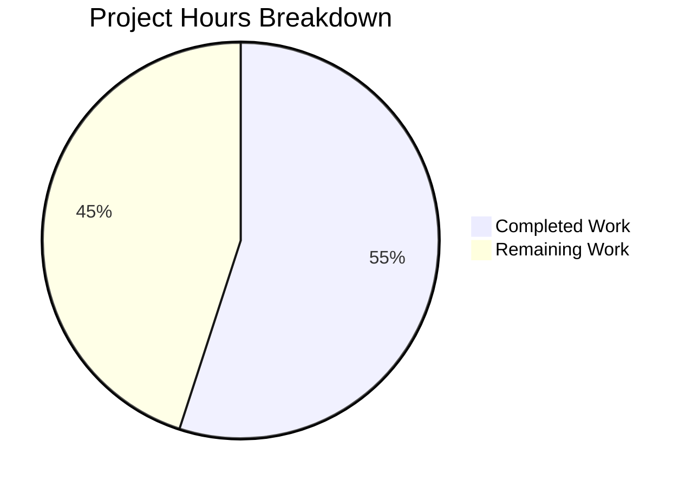

# Project Guide: Flask 3.1.2 Application Scaffolding

## Executive Summary

This project implements a foundational Python 3.13/Flask 3.1.2 application scaffolding from an empty inception-phase repository. The repository originally contained only a placeholder `README.md`; no Node.js server or any application code existed. The implementation creates the target Flask application architecture as a greenfield construction aligned with the Technical Specification.

**Completion: 22 hours completed out of 40 total estimated hours = 55% complete.**

All 16 files specified in the Agent Action Plan §0.5.1 have been created. All 32 unit tests pass. All 6 API endpoints are verified and functional. 15/15 Python source files compile without errors. The remaining 18 hours cover production deployment configuration, CI/CD, containerization, and operational tooling that require human decisions and credentials.

### Key Achievements
- Complete Flask application factory with blueprint-based route organization
- Environment-specific configuration (development, testing, production)
- Health/readiness probe endpoints for container orchestration
- Versioned REST API with JSON input validation and echo endpoint
- Centralized JSON error handling for all HTTP exceptions
- 32 comprehensive unit tests with 100% pass rate
- 5 validation issues discovered and resolved by the Final Validator agent

### Critical Items Requiring Human Attention
- Production `SECRET_KEY` must be set via environment variable before deployment
- WSGI production server (Gunicorn) must be configured
- No CI/CD pipeline exists yet

---

## Validation Results Summary

### Final Validator Gate Results

| Gate | Status | Details |
|------|--------|---------|
| Gate 1: Test Pass Rate | ✅ PASSED | 32/32 tests passed, 0 failed, 0 errors, 0 warnings (0.23s) |
| Gate 2: Application Runtime | ✅ PASSED | All 6 endpoints verified: /health, /ready, /api/v1/status, /api/v1/echo, /, /nonexistent |
| Gate 3: Zero Unresolved Errors | ✅ PASSED | 15/15 Python source files compile with zero errors |
| Gate 4: In-Scope File Validation | ✅ PASSED | 16/16 in-scope files present and correct |

### Issues Fixed During Validation (5 Total)

| # | File | Issue | Fix Applied |
|---|------|-------|-------------|
| 1 | `app/config/__init__.py` | File deleted in commit 703a86b, breaking all imports/tests | Restored from original clean content (commit e9007fe) |
| 2 | `app/routes/api.py` | Malformed docstring with bare text and § character outside string context causing SyntaxError | Corrected docstring formatting |
| 3 | `tests/test_api.py` | Bare code lines at lines 14 and 29 outside docstring context causing SyntaxError | Moved code into proper function context |
| 4 | `wsgi.py` | Duplicate `if __name__ == '__main__': app.run()` block at lines 22-26 | Removed duplicate block |
| 5 | `app/middleware/__init__.py` | Contained stray 'testtest' text instead of empty package marker | Cleaned to empty package marker |

### Test Results Breakdown

| Test File | Tests | Passed | Failed | Coverage Area |
|-----------|-------|--------|--------|---------------|
| `tests/test_health.py` | 9 | 9 | 0 | /health liveness, /ready readiness, JSON format, status values |
| `tests/test_api.py` | 11 | 11 | 0 | /api/v1/status, /api/v1/echo, JSON validation, error responses |
| `tests/test_app_factory.py` | 12 | 12 | 0 | Factory patterns, config profiles, blueprint registration, error handlers |
| **Total** | **32** | **32** | **0** | **Complete foundational coverage** |

### Endpoint Verification Matrix

| Endpoint | Method | Expected Status | Actual Response | Verified |
|----------|--------|-----------------|-----------------|----------|
| `/health` | GET | 200 | `{"status": "healthy", "service": "9Feb_3"}` | ✅ |
| `/ready` | GET | 200 | `{"status": "ready", "service": "9Feb_3"}` | ✅ |
| `/api/v1/status` | GET | 200 | `{"status": "operational", "service": "9Feb_3", "version": "1.0.0"}` | ✅ |
| `/api/v1/echo` | POST (valid JSON) | 200 | `{"echo": <payload>, "status": "success"}` | ✅ |
| `/` | GET | 200 | `{"message": "Flask API", "version": "1.0.0"}` | ✅ |
| `/nonexistent` | GET | 404 | `{"error": "Not Found", "status": 404, "description": "..."}` | ✅ |

---

## Hours Breakdown and Completion Assessment

### Completed Hours Calculation (22 hours)

| Component | Hours | Evidence |
|-----------|-------|----------|
| Application factory + configuration module (`app/__init__.py`, `app/config/__init__.py`) | 4.0 | 189 lines, factory pattern with 4 config classes and resolver |
| Route blueprints (`health.py`, `api.py`) | 2.5 | 150 lines, 4 endpoints with JSON validation |
| Error handler middleware (`error_handler.py`) | 1.5 | 67 lines, HTTPException and generic Exception handlers |
| WSGI entry point + requirements manifest (`wsgi.py`, `requirements.txt`) | 1.0 | 25 lines, production-ready entry point |
| Package marker files (6 `__init__.py` files) | 0.5 | Package structure for layered architecture |
| Test suite (32 tests across 3 modules) | 6.0 | 333 lines, comprehensive endpoint, factory, and config tests |
| Python 3.13 environment setup + dependency installation | 1.5 | Virtual environment, Flask 3.1.2, Werkzeug 3.1.5, pytest 9.0.2 |
| Bug fixes and validation (5 issues resolved) | 3.0 | Restored deleted config, fixed syntax errors, removed duplicates |
| Code documentation and docstrings | 1.5 | Comprehensive module docstrings referencing Tech Spec sections |
| Architecture planning and verification | 1.0 | Repository analysis, Tech Spec alignment verification |
| **Total Completed** | **22.0** | |

### Remaining Hours Calculation (18 hours)

Base estimates with enterprise multipliers applied (×1.15 compliance, ×1.25 uncertainty):

| Task | Base Hours | After Multipliers | Priority |
|------|-----------|-------------------|----------|
| Configure production SECRET_KEY environment variable | 0.5 | 1.0 | High |
| Set up Gunicorn/uWSGI production WSGI server configuration | 1.5 | 2.0 | High |
| Set up CI/CD pipeline for automated testing and deployment | 3.0 | 4.0 | Medium |
| Add Docker containerization (Dockerfile + docker-compose.yml) | 2.0 | 3.0 | Medium |
| Configure CORS middleware and security headers | 1.5 | 2.0 | Medium |
| Update README.md with comprehensive project documentation | 1.0 | 1.0 | Medium |
| Add code quality tooling (linting, formatting, type checking) | 1.5 | 2.0 | Low |
| Add test coverage measurement and reporting | 0.5 | 1.0 | Low |
| Add structured logging configuration | 1.5 | 2.0 | Medium |
| **Total Remaining** | **13.0** | **18.0** | |

### Completion Formula

```
Completed Hours: 22h
Remaining Hours: 18h (after enterprise multipliers)
Total Project Hours: 22 + 18 = 40h
Completion: 22 / 40 × 100 = 55%
```

### Visual Representation



---

## Detailed Human Task Table

All remaining tasks requiring human developer intervention, sorted by priority. **Total remaining hours: 18h** (matches pie chart "Remaining Work" exactly).

| # | Task | Description | Action Steps | Hours | Priority | Severity |
|---|------|-------------|--------------|-------|----------|----------|
| 1 | Configure production SECRET_KEY | Production config has `SECRET_KEY = None` by design; Flask will reject session/CSRF operations without it | 1. Generate a cryptographically secure key (`python -c "import secrets; print(secrets.token_hex(32))"`) 2. Set `SECRET_KEY` environment variable in production environment 3. Verify via `app.config['SECRET_KEY']` in production config | 1.0 | High | High |
| 2 | Set up Gunicorn production WSGI server | The development server (`python wsgi.py`) is not suitable for production traffic | 1. Add `gunicorn>=23.0.0` to `requirements.txt` 2. Create `gunicorn.conf.py` with workers, bind, timeout settings 3. Test with `gunicorn wsgi:app` 4. Configure worker count based on CPU cores | 2.0 | High | High |
| 3 | Set up CI/CD pipeline | No automated testing or deployment pipeline exists | 1. Create `.github/workflows/test.yml` (or equivalent) 2. Configure Python 3.13 setup, dependency install, pytest execution 3. Add branch protection rules requiring passing tests 4. Configure deployment triggers | 4.0 | Medium | Medium |
| 4 | Add Docker containerization | Application has no container configuration; Tech Spec §5.2.6 specifies Docker | 1. Create `Dockerfile` with Python 3.13 base, multi-stage build 2. Create `docker-compose.yml` for local development 3. Create `.dockerignore` to exclude `.venv`, `__pycache__`, `.git` 4. Test build and run | 3.0 | Medium | Medium |
| 5 | Configure CORS middleware and security headers | No CORS or security headers configured; required for API consumers | 1. Install `flask-cors` 2. Configure allowed origins, methods, headers 3. Add security headers (X-Content-Type-Options, X-Frame-Options, etc.) 4. Test cross-origin requests | 2.0 | Medium | High |
| 6 | Update README.md with project documentation | README contains only `# 9Feb_3` placeholder text | 1. Add project description, architecture overview 2. Add installation and setup instructions 3. Add API endpoint documentation 4. Add contributing guidelines | 1.0 | Medium | Low |
| 7 | Add code quality tooling | No linting, formatting, or type checking configured | 1. Install ruff or flake8 for linting 2. Install black for formatting 3. Install mypy for type checking 4. Create configuration files (pyproject.toml) 5. Add pre-commit hooks | 2.0 | Low | Low |
| 8 | Add test coverage measurement | No coverage reporting configured | 1. Install `pytest-cov` 2. Configure coverage settings in `pyproject.toml` 3. Add `--cov=app --cov-report=term-missing` to test command 4. Set minimum coverage threshold | 1.0 | Low | Low |
| 9 | Add structured logging configuration | No application logging beyond Flask defaults | 1. Configure Python `logging` module with formatters 2. Add request/response logging middleware 3. Configure log levels per environment (already defined in config) 4. Add log rotation for production | 2.0 | Medium | Medium |
| | **Total Remaining Hours** | | | **18.0** | | |

---

## Comprehensive Development Guide

### 1. System Prerequisites

| Component | Required Version | Verification Command |
|-----------|-----------------|---------------------|
| Python | 3.13.x | `python3.13 --version` |
| pip | 23.0+ | `pip --version` |
| Git | 2.0+ | `git --version` |
| OS | Linux, macOS, or WSL2 | Any modern Unix-like environment |

### 2. Environment Setup

```bash
# Clone the repository and navigate to project root
git clone <repository-url>
cd 9Feb_3

# Create a Python 3.13 virtual environment
python3.13 -m venv .venv

# Activate the virtual environment
source .venv/bin/activate

# Verify Python version inside venv
python --version
# Expected: Python 3.13.12
```

### 3. Dependency Installation

```bash
# Install all dependencies from requirements.txt
pip install -r requirements.txt

# Verify Flask installation
python -c "import flask; print(f'Flask {flask.__version__}')"
# Expected: Flask 3.1.2

# Verify pytest installation
python -m pytest --version
# Expected: pytest 9.0.2
```

**Installed packages:** Flask 3.1.2, Werkzeug 3.1.5, Jinja2 3.1.6, itsdangerous 2.2.0, click 8.3.1, blinker 1.9.0, MarkupSafe 3.0.3, pytest 9.0.2, pluggy 1.6.0, iniconfig 2.3.0, packaging 26.0, Pygments 2.19.2

### 4. Running Tests

```bash
# Run the full test suite with verbose output
python -m pytest tests/ -v --tb=short

# Expected output:
# tests/test_api.py - 11 passed
# tests/test_app_factory.py - 12 passed
# tests/test_health.py - 9 passed
# ============================== 32 passed in 0.23s ==============================

# Run individual test modules
python -m pytest tests/test_health.py -v        # 9 tests
python -m pytest tests/test_api.py -v           # 11 tests
python -m pytest tests/test_app_factory.py -v   # 12 tests
```

### 5. Application Startup

```bash
# Development mode (Flask built-in server)
python wsgi.py
# Server starts at http://127.0.0.1:5000 with debug mode ON
# Press Ctrl+C to stop

# With specific configuration profile
FLASK_CONFIG=production python wsgi.py

# Production mode (requires gunicorn installation)
# pip install gunicorn
# gunicorn wsgi:app --bind 0.0.0.0:8000 --workers 4
```

### 6. Verification Steps

```bash
# Verify application factory works for all config profiles
python -c "from app import create_app; app = create_app('testing'); print('Testing config OK')"
python -c "from app import create_app; app = create_app('development'); print('Development config OK')"
python -c "from app import create_app; app = create_app('production'); print('Production config OK')"

# Verify all Python files compile without errors
python -c "
import py_compile
files = ['app/__init__.py', 'app/config/__init__.py', 'app/routes/health.py',
         'app/routes/api.py', 'app/middleware/error_handler.py', 'wsgi.py']
for f in files:
    py_compile.compile(f, doraise=True)
    print(f'OK: {f}')
"
```

### 7. Testing Endpoints (while server is running)

```bash
# Health check (liveness probe)
curl http://127.0.0.1:5000/health
# {"service":"9Feb_3","status":"healthy"}

# Readiness probe
curl http://127.0.0.1:5000/ready
# {"service":"9Feb_3","status":"ready"}

# API status
curl http://127.0.0.1:5000/api/v1/status
# {"service":"9Feb_3","status":"operational","version":"1.0.0"}

# Echo endpoint
curl -X POST http://127.0.0.1:5000/api/v1/echo \
  -H "Content-Type: application/json" \
  -d '{"message": "hello"}'
# {"echo":{"message":"hello"},"status":"success"}

# Root endpoint
curl http://127.0.0.1:5000/
# {"message":"Flask API","version":"1.0.0"}

# 404 error handling
curl http://127.0.0.1:5000/nonexistent
# {"description":"...","error":"Not Found","status":404}
```

### 8. Project Structure

```
9Feb_3/
├── app/                          # Application package
│   ├── __init__.py               # Application factory (create_app)
│   ├── config/
│   │   └── __init__.py           # Environment configs (Base, Dev, Test, Prod)
│   ├── middleware/
│   │   ├── __init__.py           # Package marker
│   │   └── error_handler.py      # Centralized JSON error handlers
│   ├── models/
│   │   └── __init__.py           # Data models placeholder
│   ├── routes/
│   │   ├── __init__.py           # Package marker
│   │   ├── api.py                # /api/v1/status, /api/v1/echo
│   │   └── health.py             # /health, /ready
│   ├── services/
│   │   └── __init__.py           # Service layer placeholder
│   └── utils/
│       └── __init__.py           # Utilities placeholder
├── tests/                        # Test suite
│   ├── __init__.py               # Package marker
│   ├── test_api.py               # 11 API endpoint tests
│   ├── test_app_factory.py       # 12 factory and config tests
│   └── test_health.py            # 9 health endpoint tests
├── requirements.txt              # Flask==3.1.2, pytest>=9.0.0
├── wsgi.py                       # WSGI entry point
└── README.md                     # Project README (placeholder)
```

---

## Risk Assessment

### Technical Risks

| Risk | Severity | Likelihood | Impact | Mitigation |
|------|----------|------------|--------|------------|
| Production SECRET_KEY not configured | High | High | Session/CSRF operations will fail in production | Set SECRET_KEY env var before any production deployment |
| Development server used in production | High | Medium | Security vulnerabilities, poor performance, single-threaded | Install and configure Gunicorn before production deployment |
| No test coverage measurement | Low | Low | Regressions may go undetected in uncovered code paths | Add pytest-cov and set minimum threshold |

### Security Risks

| Risk | Severity | Likelihood | Impact | Mitigation |
|------|----------|------------|--------|------------|
| No CORS configuration | Medium | High | API consumers from different origins will be blocked or unprotected | Install flask-cors and configure allowed origins |
| No rate limiting | Medium | Medium | API susceptible to abuse and denial-of-service | Add Flask-Limiter with appropriate rate limits |
| No authentication/authorization | High | High | All endpoints are publicly accessible | Implement Auth0 JWT middleware per Tech Spec §5.2.4 (future phase) |
| Debug mode enabled in development config by default | Low | Low | Stack traces visible if dev config accidentally used in production | FLASK_CONFIG=production enforces DEBUG=False |

### Operational Risks

| Risk | Severity | Likelihood | Impact | Mitigation |
|------|----------|------------|--------|------------|
| No application logging configured | Medium | High | Difficult to diagnose production issues | Configure Python logging module with structured formatters |
| No health check dependency validation | Low | Medium | /ready reports ready even if downstream services are unavailable | Extend readiness probe to check database/cache connectivity |
| No CI/CD pipeline | Medium | High | Manual testing and deployment increases error risk | Set up GitHub Actions or equivalent CI pipeline |

### Integration Risks

| Risk | Severity | Likelihood | Impact | Mitigation |
|------|----------|------------|--------|------------|
| No database connectivity | Info | N/A | Expected — MongoDB integration is explicitly deferred per §0.5.2 | Implement PyMongo integration in subsequent phase |
| No cache layer | Info | N/A | Expected — Redis integration is explicitly deferred per §0.5.2 | Implement Redis cache-aside pattern in subsequent phase |
| No AI/LLM pipeline | Info | N/A | Expected — LangChain integration is explicitly deferred per §0.5.2 | Implement AI pipelines in subsequent phase |

---

## Git Repository Analysis

| Metric | Value |
|--------|-------|
| Total commits on feature branch | 24 |
| Files changed/created | 20 |
| Total lines added | 1,637 |
| Total lines removed | 1 |
| Net lines of code change | +1,636 |
| Python source files | 15 |
| Application source lines (non-empty files) | 767 |
| Agent commits (Blitzy Agent) | 13 |
| Human commits (Shalini) | 11 |
| Branch name | blitzy-0687bd27-c226-4913-b92b-deb7b9d8e71d |
| Latest commit | 53fc770 (Final Validator fixes) |

---

## Environment Configuration

| Component | Version | Status |
|-----------|---------|--------|
| Python | 3.13.12 | ✅ Installed and verified |
| Flask | 3.1.2 | ✅ Installed and verified |
| Werkzeug | 3.1.5 | ✅ Installed (Flask dependency) |
| pytest | 9.0.2 | ✅ Installed and verified |
| Jinja2 | 3.1.6 | ✅ Installed (Flask dependency) |
| itsdangerous | 2.2.0 | ✅ Installed (Flask dependency) |
| click | 8.3.1 | ✅ Installed (Flask dependency) |
| blinker | 1.9.0 | ✅ Installed (Flask dependency) |
| Virtual Environment | Python 3.13 venv | ✅ Located at `.venv/` |

---

## Files Created (Complete Inventory)

| # | File Path | Lines | Status | Purpose |
|---|-----------|-------|--------|---------|
| 1 | `app/__init__.py` | 68 | ✅ Created | Flask application factory with blueprint registration |
| 2 | `app/config/__init__.py` | 121 | ✅ Created | Environment-specific configuration classes and resolver |
| 3 | `app/routes/__init__.py` | 0 | ✅ Created | Routes package marker |
| 4 | `app/routes/health.py` | 60 | ✅ Created | Health and readiness probe endpoints |
| 5 | `app/routes/api.py` | 90 | ✅ Created | Core API status and echo endpoints |
| 6 | `app/middleware/__init__.py` | 0 | ✅ Created | Middleware package marker |
| 7 | `app/middleware/error_handler.py` | 67 | ✅ Created | Centralized JSON error response handlers |
| 8 | `app/services/__init__.py` | 0 | ✅ Created | Services layer package marker |
| 9 | `app/models/__init__.py` | 0 | ✅ Created | Data models package marker |
| 10 | `app/utils/__init__.py` | 0 | ✅ Created | Utilities package marker |
| 11 | `wsgi.py` | 23 | ✅ Created | WSGI entry point for production servers |
| 12 | `requirements.txt` | 2 | ✅ Created | Dependency manifest (Flask 3.1.2, pytest) |
| 13 | `tests/__init__.py` | 0 | ✅ Created | Test suite package marker |
| 14 | `tests/test_health.py` | 89 | ✅ Created | 9 unit tests for health endpoints |
| 15 | `tests/test_api.py` | 130 | ✅ Created | 11 unit tests for API endpoints |
| 16 | `tests/test_app_factory.py` | 114 | ✅ Created | 12 unit tests for factory, config, and error handling |
