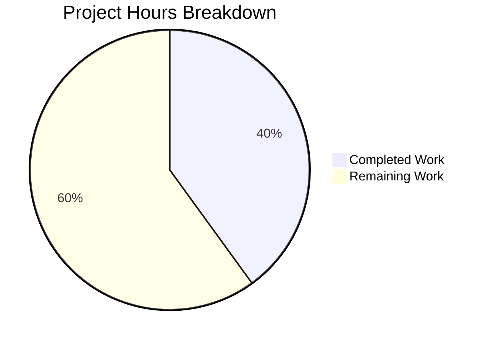

# Project Guide: Python/Flask 3.1.2 Server Scaffolding

## Executive Summary

This project creates a foundational Python/Flask 3.1.2 server from an empty inception-phase repository. The original request was to rewrite a Node.js server in Python 3 using Flask; however, the repository contained no Node.js source code — only a placeholder `README.md`. The agents treated this as a greenfield implementation of the target Flask architecture per the Technical Specification.

**Completion: 18 hours completed out of 45 total hours = 40.0% complete.**

All 16 files specified in the Agent Action Plan were created and verified. The test suite (32 tests) passes at 100% with zero failures, zero errors, and zero warnings. All 6 REST endpoints are verified functional. Compilation succeeds on all 15 Python source files. No validation issues were found by the Final Validator agent — zero fixes were required.

The remaining 27 hours represent production-readiness work (logging, CORS, security headers, Docker, CI/CD, API documentation) and quality extensions (test coverage tooling, request validation, rate limiting) that are outside the foundational scaffolding scope but essential before production deployment.

### Key Achievements
- Complete Flask application factory with blueprint-based architecture
- 4 environment-specific configuration profiles (Development, Testing, Production, Default)
- Health/readiness probe endpoints for container orchestration
- Versioned REST API with JSON input validation and structured error responses
- 32 comprehensive unit tests covering all endpoints, configurations, and edge cases
- Clean layered package structure ready for future extension

### Critical Items for Human Developers
- No `.gitignore` file exists — Python bytecode and venv directories should be excluded
- Production `SECRET_KEY` must be configured via environment variable before deployment
- No structured logging — application lacks runtime observability
- No CORS middleware — API is inaccessible from browser-based clients
- No production WSGI server (Gunicorn) in `requirements.txt`

---

## Hours Calculation

### Completed Hours Breakdown (18h)

| Component | Files | Lines | Hours | Description |
|-----------|-------|-------|-------|-------------|
| Architecture & Tech Spec Alignment | — | — | 2.0 | Design decisions, factory pattern, blueprint organization |
| Application Factory + Config System | 2 | 189 | 4.0 | `app/__init__.py` (68 lines), `app/config/__init__.py` (121 lines) |
| Route Blueprints (Health + API) | 2 | 150 | 3.0 | `health.py` (60 lines), `api.py` (90 lines) |
| Error Handling Middleware | 1 | 67 | 1.5 | `error_handler.py` with HTTPException and generic handlers |
| WSGI Entry + Package Structure | 8 | 30 | 1.5 | `wsgi.py` (23 lines), 6 `__init__.py` markers, `requirements.txt` |
| Unit Test Suite (32 tests) | 3 | 333 | 4.0 | `test_health.py` (9), `test_api.py` (11), `test_app_factory.py` (12) |
| Environment Setup + Validation | — | — | 2.0 | Python 3.13 venv, pip install, all-gate validation |
| **Total** | **16** | **770** | **18.0** | |

### Remaining Hours Breakdown (27h)

Base estimates (19h) with enterprise multipliers applied (×1.15 compliance × 1.25 uncertainty = ×1.44):

19h × 1.44 = 27.4h → rounded to 27h

### Completion Percentage Formula

```
Completion % = Completed Hours / (Completed Hours + Remaining Hours) × 100
Completion % = 18 / (18 + 27) × 100
Completion % = 18 / 45 × 100
Completion % = 40.0%
```

---

## Visual Representation



---

## Validation Results

### Gate 1: Dependencies — PASS
All dependencies installed cleanly. `pip check` reports no broken requirements.

| Package | Version | Status |
|---------|---------|--------|
| Flask | 3.1.2 | ✅ Installed |
| Werkzeug | 3.1.5 | ✅ Installed (Flask dependency) |
| Jinja2 | 3.1.6 | ✅ Installed (Flask dependency) |
| pytest | 9.0.2 | ✅ Installed |
| Click | 8.3.1 | ✅ Installed (Flask dependency) |
| Blinker | 1.9.0 | ✅ Installed (Flask dependency) |
| ItsDangerous | 2.2.0 | ✅ Installed (Flask dependency) |
| MarkupSafe | 3.0.3 | ✅ Installed (Jinja2 dependency) |

### Gate 2: Compilation — PASS
All 15 Python files pass `python -m py_compile` with zero errors.

### Gate 3: Tests — PASS (32/32, 100%)

| Test File | Tests | Passed | Failed | Coverage Area |
|-----------|-------|--------|--------|---------------|
| `tests/test_api.py` | 11 | 11 | 0 | `/api/v1/status`, `/api/v1/echo`, JSON validation, errors |
| `tests/test_app_factory.py` | 12 | 12 | 0 | Factory pattern, config profiles, blueprints, error handlers |
| `tests/test_health.py` | 9 | 9 | 0 | `/health` liveness, `/ready` readiness, JSON format |
| **Total** | **32** | **32** | **0** | **0.23s execution time** |

### Gate 4: Runtime — PASS
All 6 endpoints verified via Flask test client:

| Endpoint | Method | Status | Response Body |
|----------|--------|--------|---------------|
| `/health` | GET | 200 | `{"status": "healthy", "service": "9Feb_3"}` |
| `/ready` | GET | 200 | `{"status": "ready", "service": "9Feb_3"}` |
| `/api/v1/status` | GET | 200 | `{"status": "operational", "service": "9Feb_3", "version": "1.0.0"}` |
| `/api/v1/echo` | POST | 200 | `{"echo": <payload>, "status": "success"}` |
| `/` | GET | 200 | `{"message": "Flask API", "version": "1.0.0"}` |
| `/nonexistent` | GET | 404 | `{"error": "Not Found", "status": 404, "description": "..."}` |

### Fixes Applied During Validation
**None required.** All files were correctly implemented by implementation agents. The Final Validator confirmed zero errors across all four validation gates.

---

## Detailed Task Table for Human Developers

All remaining tasks (27.0 hours total) required to reach production readiness:

| # | Task | Description | Hours | Priority | Severity | Confidence |
|---|------|-------------|-------|----------|----------|------------|
| 1 | Add `.gitignore` for Python project | Create `.gitignore` excluding `__pycache__/`, `.venv/`, `*.pyc`, `.pytest_cache/`, `*.egg-info/`, `.env` files. Currently bytecode dirs are untracked but visible in `git status`. | 1.0 | High | Medium | High |
| 2 | Configure production `SECRET_KEY` and environment variables | Set `SECRET_KEY` via environment variable for production deployment. `ProductionConfig` reads `os.environ.get('SECRET_KEY')` which returns `None` if not set — Flask will reject session/CSRF operations. Document all required env vars. | 1.0 | High | Critical | High |
| 3 | Add structured logging with environment-based log levels | Implement Python `logging` module integration with rotating file handlers. Config classes define `LOG_LEVEL` but no logging infrastructure exists. Add request/response logging middleware for observability. | 3.0 | High | High | High |
| 4 | Configure CORS middleware for cross-origin API access | Install and configure `flask-cors` to allow browser-based API consumers. Without CORS headers, the API is inaccessible from any web frontend, which the Tech Spec describes as a future integration point. | 1.5 | High | High | High |
| 5 | Set up Gunicorn as production WSGI server | Add `gunicorn` to `requirements.txt`, create `gunicorn.conf.py` with worker count, bind address, timeout settings. The `wsgi.py` entry point is ready but `app.run()` is development-only. | 2.0 | High | High | High |
| 6 | Add security headers middleware | Install `Flask-Talisman` or manually configure `Content-Security-Policy`, `X-Content-Type-Options`, `X-Frame-Options`, `Strict-Transport-Security` headers. No security headers are currently set on any response. | 2.0 | High | High | Medium |
| 7 | Create Dockerfile and docker-compose.yml | Write multi-stage Dockerfile (Python 3.13-slim base, pip install, Gunicorn entrypoint). Create `docker-compose.yml` for local development. Tech Spec §5.2.6 specifies Docker 27.x+ as target. | 3.5 | Medium | Medium | Medium |
| 8 | Configure CI/CD pipeline (GitHub Actions) | Create `.github/workflows/ci.yml` with lint (flake8/ruff), test (pytest), and build stages. Add branch protection rules. No CI/CD configuration exists in the repository. | 3.5 | Medium | Medium | Medium |
| 9 | Add pytest-cov for test coverage reporting | Install `pytest-cov`, configure in `pyproject.toml` or `setup.cfg`, add coverage thresholds. Current 32 tests have no coverage measurement. Target: 90%+ line coverage. | 1.0 | Medium | Low | High |
| 10 | Write OpenAPI/Swagger API documentation | Create OpenAPI 3.0 specification documenting all 6 endpoints, request/response schemas, error formats. Optionally integrate `flask-openapi3` or `flasgger` for auto-generated Swagger UI. | 3.0 | Medium | Medium | Medium |
| 11 | Add request validation schemas (Marshmallow/Pydantic) | Implement input validation for `/api/v1/echo` and future endpoints using Marshmallow or Pydantic. Current validation is manual `request.is_json` checks — add schema-based validation with descriptive error messages. | 2.5 | Medium | Medium | Medium |
| 12 | Add request rate limiting middleware | Install `Flask-Limiter` with configurable rate limits per endpoint. Protect `/api/v1/echo` and public endpoints from abuse. No rate limiting currently exists. | 2.0 | Low | Medium | Medium |
| 13 | Performance testing and optimization | Run load tests (locust/wrk) against all endpoints. Profile Flask request handling. Optimize any bottlenecks discovered. Establish performance baselines for future regression testing. | 1.5 | Low | Low | Low |
| | **Total Remaining Hours** | | **27.0** | | | |

### Verification: Task hours (27.0) = Pie chart "Remaining Work" (27) ✓

---

## Comprehensive Development Guide

### 1. System Prerequisites

| Requirement | Version | Purpose |
|-------------|---------|---------|
| Python | 3.13.x | Runtime — application built on Python 3.13.12 |
| pip | 25.x+ | Package installer (bundled with Python 3.13) |
| Git | 2.x+ | Version control |
| OS | Linux / macOS / WSL2 | Tested on Linux (Ubuntu) |

### 2. Clone and Branch Setup

```bash
# Clone the repository
git clone <repository-url>
cd 9Feb_3

# Switch to the feature branch
git checkout blitzy-0687bd27-c226-4913-b92b-deb7b9d8e71d
```

### 3. Environment Setup

```bash
# Create a Python 3.13 virtual environment
python3.13 -m venv .venv

# Activate the virtual environment
source .venv/bin/activate    # Linux/macOS
# .venv\Scripts\activate     # Windows

# Verify Python version
python --version
# Expected output: Python 3.13.12
```

### 4. Dependency Installation

```bash
# Install all dependencies from requirements.txt
pip install -r requirements.txt

# Verify installation
pip check
# Expected output: No broken requirements found.

# Verify Flask version
python -c "import flask; print(f'Flask {flask.__version__}')"
# Expected output: Flask 3.1.2
```

### 5. Run the Test Suite

```bash
# Run all 32 tests with verbose output
python -m pytest tests/ -v --tb=short

# Expected output:
# tests/test_api.py - 11 PASSED
# tests/test_app_factory.py - 12 PASSED
# tests/test_health.py - 9 PASSED
# ============================== 32 passed in ~0.23s ==============================
```

### 6. Verify Application Factory

```bash
# Verify the factory pattern works for each configuration
python -c "from app import create_app; app = create_app('testing'); print('Testing config OK')"
python -c "from app import create_app; app = create_app('development'); print('Development config OK')"
python -c "from app import create_app; app = create_app('production'); print('Production config OK')"
```

### 7. Start the Development Server

```bash
# Start Flask development server (port 5000)
python wsgi.py

# Or use Flask CLI:
FLASK_CONFIG=development python -m flask --app wsgi:app run --port 5000
```

**Note:** The development server is NOT suitable for production. Use Gunicorn for production (see Task #5 in the task table).

### 8. Test Endpoints Manually

With the server running, test in a separate terminal:

```bash
# Health check (liveness probe)
curl http://localhost:5000/health
# {"service":"9Feb_3","status":"healthy"}

# Readiness probe
curl http://localhost:5000/ready
# {"service":"9Feb_3","status":"ready"}

# API status
curl http://localhost:5000/api/v1/status
# {"service":"9Feb_3","status":"operational","version":"1.0.0"}

# Echo endpoint
curl -X POST http://localhost:5000/api/v1/echo \
  -H "Content-Type: application/json" \
  -d '{"message": "hello", "number": 42}'
# {"echo":{"message":"hello","number":42},"status":"success"}

# Root route
curl http://localhost:5000/
# {"message":"Flask API","version":"1.0.0"}

# Error handling (404)
curl http://localhost:5000/nonexistent
# {"description":"...","error":"Not Found","status":404}
```

### 9. Project Structure

```
9Feb_3/
├── README.md                    # Original placeholder (unchanged)
├── requirements.txt             # Flask==3.1.2, pytest>=9.0.0
├── wsgi.py                      # WSGI entry point (Gunicorn/uWSGI compatible)
├── app/
│   ├── __init__.py              # Application factory: create_app()
│   ├── config/
│   │   └── __init__.py          # BaseConfig, Dev, Testing, Production configs
│   ├── routes/
│   │   ├── __init__.py          # Package marker
│   │   ├── health.py            # /health, /ready endpoints
│   │   └── api.py               # /api/v1/status, /api/v1/echo endpoints
│   ├── middleware/
│   │   ├── __init__.py          # Package marker
│   │   └── error_handler.py     # Centralized JSON error handlers
│   ├── services/
│   │   └── __init__.py          # Service layer (placeholder for business logic)
│   ├── models/
│   │   └── __init__.py          # Data models (placeholder for PyMongo schemas)
│   └── utils/
│       └── __init__.py          # Utilities (placeholder for helper functions)
└── tests/
    ├── __init__.py              # Test package marker
    ├── test_health.py           # 9 tests for health/readiness endpoints
    ├── test_api.py              # 11 tests for API status/echo endpoints
    └── test_app_factory.py      # 12 tests for factory, config, error handling
```

### 10. Configuration Profiles

The application supports four configuration profiles, selected via `FLASK_CONFIG` environment variable:

| Profile | `FLASK_CONFIG` Value | DEBUG | TESTING | LOG_LEVEL | Use Case |
|---------|---------------------|-------|---------|-----------|----------|
| Development | `development` or `default` | True | False | DEBUG | Local development |
| Testing | `testing` | True | True | DEBUG | Test execution |
| Production | `production` | False | False | WARNING | Production deployment |

```bash
# Select configuration at startup
FLASK_CONFIG=production python wsgi.py
```

### 11. Troubleshooting

| Issue | Cause | Resolution |
|-------|-------|------------|
| `ModuleNotFoundError: No module named 'flask'` | Virtual environment not activated | Run `source .venv/bin/activate` |
| `python3.13: command not found` | Python 3.13 not installed | Install via deadsnakes PPA or pyenv |
| `ImportError: cannot import name 'create_app'` | Not in project root directory | `cd` to the repository root before running |
| `Address already in use` (port 5000) | Another process on port 5000 | Kill the process or use `--port 5001` |

---

## Git History Summary

| Commits | Files Created | Lines Added | Lines Removed | Net Change |
|---------|--------------|-------------|---------------|------------|
| 9 (agent) + 1 (initial) | 16 | 770 | 0 | +770 |

### Commit Log (newest first)
1. `0544061` — Create `tests/__init__.py` package marker
2. `cb6cce7` — Create `app/routes/__init__.py` package marker
3. `16d2df4` — Create `app/middleware/__init__.py` package marker
4. `3428622` — Create `app/services/__init__.py` package marker
5. `3dd5b10` — Create `app/utils/__init__.py` package marker
6. `909576a` — Create `app/models/__init__.py` package marker
7. `f92ff2a` — Create Flask application scaffolding (factory, routes, middleware, tests)
8. `e9007fe` — Create `app/config/__init__.py` configuration module
9. `bb263e0` — Create `requirements.txt` with Flask 3.1.2 and pytest

---

## Risk Assessment

### Technical Risks

| Risk | Severity | Likelihood | Impact | Mitigation |
|------|----------|------------|--------|------------|
| No `.gitignore` — bytecode committed accidentally | Medium | High | Low | Create `.gitignore` before next commit (Task #1) |
| No structured logging — runtime issues invisible | High | High | High | Implement Python logging integration (Task #3) |
| Development-only `SECRET_KEY` in `BaseConfig` | Critical | Medium | Critical | Set `SECRET_KEY` env var before production deploy (Task #2) |
| `app.run()` used in production instead of Gunicorn | High | Medium | High | Add Gunicorn to requirements, document deployment (Task #5) |

### Security Risks

| Risk | Severity | Likelihood | Impact | Mitigation |
|------|----------|------------|--------|------------|
| Hardcoded `dev-secret-key-change-in-production` in BaseConfig | Critical | Low (if env var set) | Critical | Production config reads `SECRET_KEY` from env only — enforce this |
| No CORS headers — susceptible to CSRF from any origin | Medium | Medium | Medium | Add `flask-cors` with allowlist (Task #4) |
| No security headers (CSP, HSTS, X-Frame-Options) | Medium | Medium | Medium | Add Flask-Talisman or manual headers (Task #6) |
| No rate limiting — endpoints vulnerable to abuse | Medium | Medium | Medium | Add Flask-Limiter (Task #12) |
| No authentication/authorization on any endpoint | High | High | High | Future phase: Auth0 JWT integration per Tech Spec §5.2.4 |

### Operational Risks

| Risk | Severity | Likelihood | Impact | Mitigation |
|------|----------|------------|--------|------------|
| No CI/CD pipeline — manual testing only | Medium | High | Medium | Set up GitHub Actions (Task #8) |
| No Docker configuration — environment-dependent deployment | Medium | Medium | Medium | Create Dockerfile (Task #7) |
| No health check dependency validation (DB, cache) | Low | Low | Medium | Future phase: extend `/ready` to check downstream services |
| No test coverage measurement | Low | Medium | Low | Add pytest-cov (Task #9) |

### Integration Risks

| Risk | Severity | Likelihood | Impact | Mitigation |
|------|----------|------------|--------|------------|
| MongoDB/PyMongo not integrated (Tech Spec §5.2.3) | High | N/A | High | Future phase — service/model layers are scaffolded as empty packages |
| Redis caching not integrated (Tech Spec §5.2.3) | Medium | N/A | Medium | Future phase — requires Redis server provisioning |
| Auth0 not integrated (Tech Spec §5.2.4) | High | N/A | High | Future phase — requires Auth0 tenant and API credentials |
| LangChain/LangGraph not integrated (Tech Spec §5.2.2) | Medium | N/A | Medium | Future phase — requires LLM provider API keys |

---

## Files Inventory

### Application Source Files (10 files, 437 lines)

| File | Lines | Role |
|------|-------|------|
| `app/__init__.py` | 68 | Flask application factory with blueprint registration |
| `app/config/__init__.py` | 121 | 4 environment config classes + `get_config()` resolver |
| `app/routes/__init__.py` | 1 | Routes package marker |
| `app/routes/health.py` | 60 | `/health` and `/ready` probe endpoints |
| `app/routes/api.py` | 90 | `/api/v1/status` and `/api/v1/echo` endpoints |
| `app/middleware/__init__.py` | 1 | Middleware package marker |
| `app/middleware/error_handler.py` | 67 | Centralized JSON error response handlers |
| `app/services/__init__.py` | 1 | Services layer package marker |
| `app/models/__init__.py` | 1 | Data models package marker |
| `app/utils/__init__.py` | 1 | Utilities package marker |

### Infrastructure Files (2 files, 25 lines)

| File | Lines | Role |
|------|-------|------|
| `wsgi.py` | 23 | WSGI entry point for Gunicorn/uWSGI |
| `requirements.txt` | 2 | Dependency manifest (Flask 3.1.2, pytest ≥9.0.0) |

### Test Files (4 files, 334 lines)

| File | Lines | Tests | Role |
|------|-------|-------|------|
| `tests/__init__.py` | 1 | — | Test package marker |
| `tests/test_health.py` | 89 | 9 | Health/readiness endpoint tests |
| `tests/test_api.py` | 130 | 11 | API status/echo endpoint tests |
| `tests/test_app_factory.py` | 114 | 12 | Factory, config, blueprint, error handler tests |

---

## Future Phase Roadmap (Not in Current Scope)

The Technical Specification defines a comprehensive architecture beyond this foundational scaffolding. These were explicitly excluded from the Agent Action Plan:

| Phase | Component | Tech Spec Reference | Estimated Hours |
|-------|-----------|-------------------|-----------------|
| 2 | MongoDB/PyMongo data layer integration | §5.2.3 | 16h |
| 2 | Redis caching (cache-aside pattern) | §5.2.3 | 8h |
| 3 | Auth0 JWT authentication middleware | §5.2.4 | 12h |
| 4 | LangChain/LangGraph AI pipelines (3 pipelines) | §5.2.2 | 40h |
| 4 | Service layer business logic | §5.2.1 | 16h |
| 5 | Frontend applications (React, mobile, desktop) | §5.2.5 | 160h+ |
| 5 | Docker/Terraform infrastructure | §5.2.6 | 20h |

These phases build on the delivered scaffolding — the package structure (`services/`, `models/`, `utils/`) is already in place as empty packages ready for implementation.
